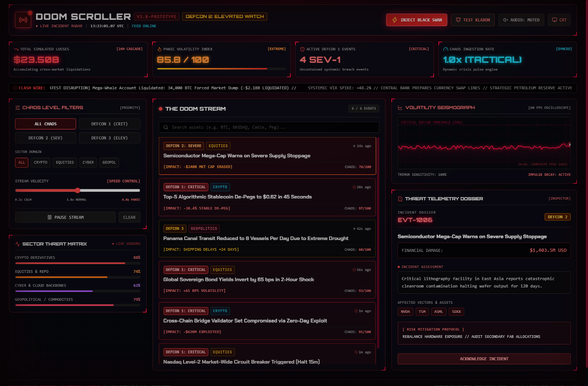

# 🚨 Doom Scroller Dashboard // Emergency Control Room

A high-intensity, cinematic single-page web dashboard simulating real-time high-volatility financial collapses, crypto liquidations, cyber warfare strikes, and geopolitical black swans.



---

## ⚡ Features

- **Emergency Control Room Aesthetic**:
  - Tactical dark palette (`#05060a`), neon crimson (`#ff1244`) glow accents, corner bracket reticles (`[ + ]`), and CRT scanline overlay.
  - Live UTC tactical clock with millisecond precision.
- **Flashing Alarm Component & Klaxon Siren**:
  - Automatically triggers whenever incoming events breach the critical chaos threshold ($\ge 90$ or DEFCON 1).
  - High-visibility full-screen perimeter strobe flash and wailing Klaxon alert banner.
  - **Procedural Web Audio API sound generator**: 100% self-contained emergency siren sweeps and impact alerts with zero external audio file dependencies.
  - Interactive **Silence Klaxon** and **Test Klaxon** controls.
- **The Doom Stream (Live Feed Engine)**:
  - Procedural simulation generating authentic crisis events across **Crypto & DeFi**, **Traditional Equities & Repo**, **Cyber & Infrastructure**, and **Geopolitical & Macro** sectors.
  - Real-time search filter and auto-calculated time-ago counters.
- **Tactical Chaos Filters & Controls**:
  - **DEFCON Severity Filter**: Filter by `ALL`, `DEFCON 1 (Catastrophic)`, `DEFCON 2 (Severe)`, or `DEFCON 3 (Elevated)`.
  - **Sector Domain Filter**: Filter by `Crypto`, `Equities`, `Cyber`, or `Geopolitics`.
  - **Stream Velocity Slider**: Adjust feed ingestion speed from `0.2x (Calm)` up to `4.0x (Total Collapse)`.
  - **Inject Black Swan Button**: Manually forces an instant DEFCON 1 market meltdown with visual screen shake and alarm trigger.
  - **Pause / Resume Feed** & **Clear Stream** toggles.
- **Real-Time Telemetry & Visualizations**:
  - **Volatility Seismograph**: 60 FPS HTML5 canvas oscilloscope displaying continuous ECG-style volatility wave tremors with impulse shock spikes.
  - **Rolling Metric Counters**: Total Simulated Losses in USD (`$XX.XX Billion`), Global Panic Volatility Index (`0-100`), Active DEFCON 1 count, and Feed Velocity.
  - **Sector Threat Matrix**: Real-time stress meters for Crypto Derivatives, Equities & Repo, Cyber/Cloud Backbones, and Geopolitical Commodities.
  - **Threat Telemetry Dossier**: Click any event card in the stream to inspect its root cause analysis, affected ticker vectors, and mitigation protocol.

---

## 🚀 How to Run

Simply open `index.html` in any modern web browser (Chrome, Edge, Firefox, Brave, Safari):

```bash
# On Windows PowerShell
Start-Process .\index.html
```

Or double-click `index.html` in File Explorer. No Node.js build steps, compilation, or server setup required!

---

## 🛠️ Tech Stack

- **HTML5** & **Semantic Components**
- **Tailwind CSS** (via official CDN)
- **Vanilla JavaScript (ES6+)**
- **HTML5 2D Canvas** (Oscilloscope seismograph)
- **Web Audio API** (Zero-dependency procedural sound synthesis)
- **Lucide Icons**
